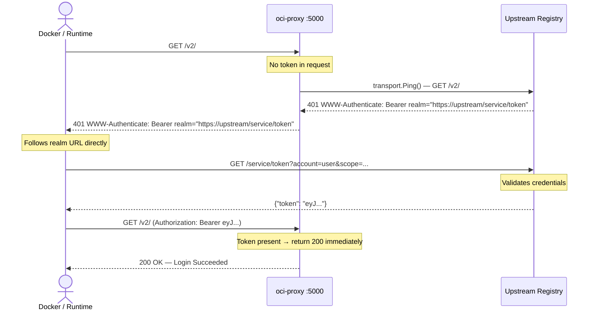
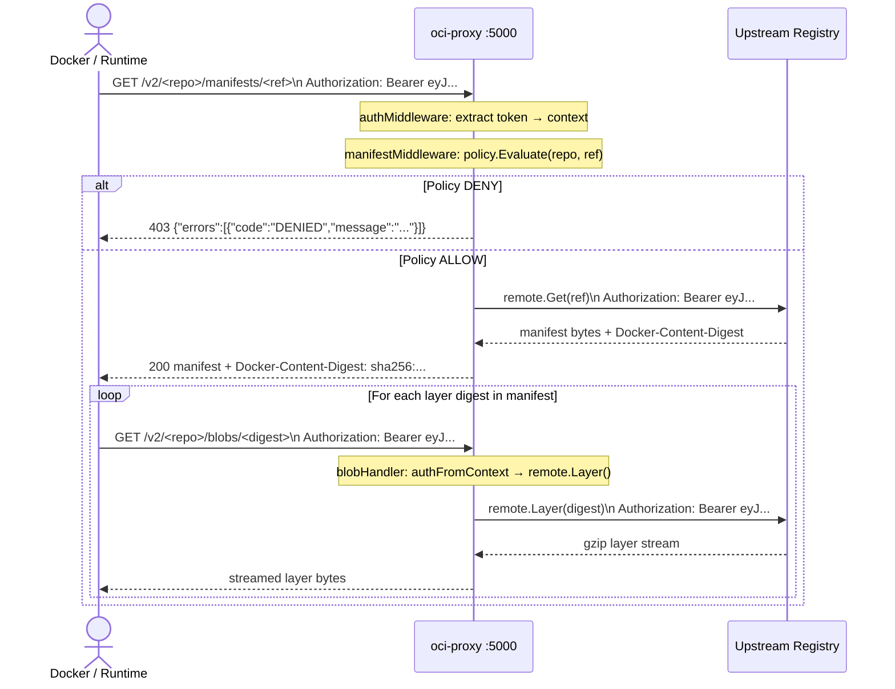
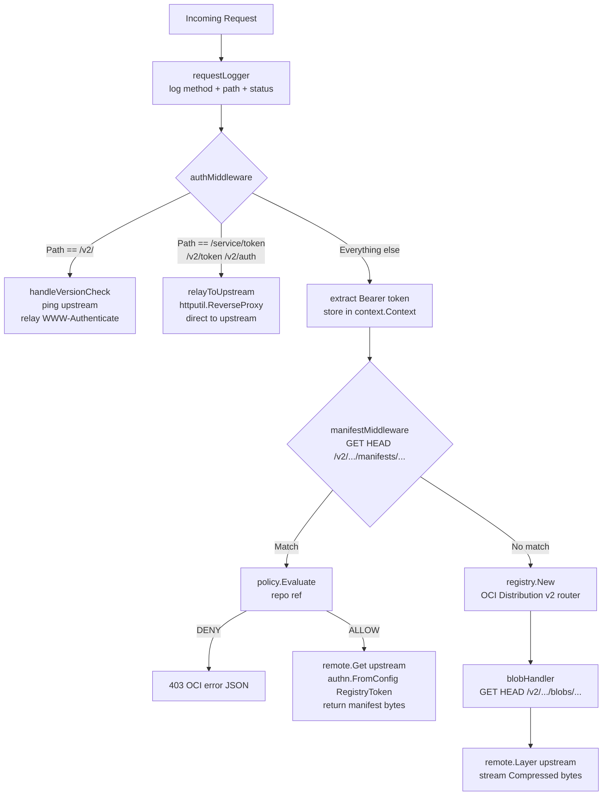

# oci-proxy

A policy-enforcing OCI pull-through proxy built entirely on [`google/go-containerregistry`](https://github.com/google/go-containerregistry). Sits between container runtimes and an upstream registry — intercepts every pull, applies policy, and forwards using the runtime's own bearer token.

Built as a proof-of-concept for the [Harbor Satellite](https://satellite.container-registry.com/) proxy layer.

---

## Table of Contents

- [Project Structure](#project-structure)
- [Setup](#setup)
- [Auth Flow](#auth-flow-docker-login)
- [Image Pull Flow](#image-pull-flow-docker-pull)
- [Request Pipeline](#request-pipeline)
- [Policy](#policy)
- [Configuration](#configuration)

---

## Project Structure

```
oci-proxy/
├── main.go                   entry point, wires config + HTTP server
└── proxy/
    ├── handler.go            NewHandler() — assembles the middleware pipeline
    ├── auth.go               authMiddleware — challenge relay, token passthrough, token context
    ├── manifest_handler.go   manifestMiddleware — policy check + upstream manifest fetch
    ├── blob_handler.go       blobHandler — upstream blob streaming (BlobHandler + BlobStatHandler)
    ├── policy.go             Policy interface, CompositePolicy, DenyImageName, DenyTag
    ├── policy_test.go        unit tests for all policy rules
    └── handler_test.go       integration tests for the full HTTP pipeline
```

---

## Setup

**Requirements:** Go 1.22+

```bash
git clone https://github.com/your-org/oci-proxy
cd oci-proxy
go mod download
go run .
```

**Override defaults with env vars:**

```bash
LISTEN_ADDR=:8080 UPSTREAM_REGISTRY=demo.goharbor.io go run .
```

| Variable            | Default                  | Description                        |
|---------------------|--------------------------|------------------------------------|
| `LISTEN_ADDR`       | `:5000`                  | Address the proxy listens on       |
| `UPSTREAM_REGISTRY` | `registry-1.docker.io`   | Upstream registry host to proxy to |

---

## Auth Flow (`docker login`)

The proxy never handles credentials. It relays the upstream auth challenge to the runtime, which fetches the token directly from the upstream auth server. The proxy only ever sees and reuses the token the runtime already holds.



**Steps:**

1. Runtime hits `GET /v2/` on the proxy — no token yet.
2. Proxy pings the real upstream to get its `WWW-Authenticate` challenge, caches it (10 min TTL), relays it as `401`.
3. Runtime reads the `realm=` URL from the challenge header and fetches a token **directly** from the upstream auth server — this call bypasses the proxy entirely and the proxy never touches your credentials.
4. Runtime retries `GET /v2/` with `Authorization: Bearer <token>`. Proxy sees the token and returns `200` — login complete.

---

## Image Pull Flow (`docker pull`)

After login, the runtime holds a bearer token scoped to the upstream registry. Every subsequent pull goes through the proxy.



**Steps:**

1. Runtime requests the manifest. `authMiddleware` extracts the bearer token from `Authorization: Bearer` and stores it in the request context.
2. `manifestMiddleware` evaluates policy on `(repo, ref)`. Denied → `403` immediately, no upstream contact.
3. Allowed → proxy calls `remote.Get()` on the upstream, replaying the token via `authn.FromConfig{RegistryToken: token}`. Returns the raw manifest bytes with the correct `Docker-Content-Digest` header.
4. Runtime parses the manifest, extracts blob digests, and requests each layer.
5. `blobHandler.Get()` calls `remote.Layer()` on the upstream with the same token, streams the compressed blob directly to the runtime — no buffering in memory.

---

## Request Pipeline

Every incoming HTTP request flows through four layers assembled by `NewHandler()`:



---

## Policy

Policy is evaluated in `manifestMiddleware` on every manifest request. A denied manifest breaks the pull before any blob is fetched.

### Built-in rules

**`DenyImageName(name string)`** — blocks any repo whose final path segment matches `name`, case-insensitive. Substring is not a match (`busybox-extra` is not blocked by `DenyImageName("busybox")`).

**`DenyTag(tag string)`** — blocks exact tag matches, case-insensitive. Digest refs (`sha256:...`) always bypass this rule.

**`AllowAll`** — permits everything. Default when `Policy` is `nil`.

### Composing rules

Rules run in order. The first `DENY` wins.

```go
policy := proxy.NewCompositePolicy(
    proxy.DenyImageName("busybox"),   // rule 1
    proxy.DenyTag("latest"),          // rule 2
)
```

### Writing a custom rule

Implement the `Policy` interface:

```go
type Policy interface {
    Evaluate(repo, ref string) Decision
}
```

`repo` — repository path, e.g. `library/nginx`
`ref`  — tag or digest, e.g. `1.25` or `sha256:abc...`

Example — allow only images from `myorg`:

```go
proxy.PolicyFunc(func(repo, ref string) proxy.Decision {
    if !strings.HasPrefix(repo, "myorg/") {
        return proxy.Decision{Allow: false, Reason: "only myorg images are permitted"}
    }
    return proxy.Decision{Allow: true}
})
```

### Policy behaviour table

| Image | Result | Rule fired |
|---|---|---|
| `library/alpine:3.19` | ✅ ALLOW | — |
| `library/nginx:1.25` | ✅ ALLOW | — |
| `library/alpine:latest` | ❌ DENY | `DenyTag("latest")` |
| `library/busybox:1.36` | ❌ DENY | `DenyImageName("busybox")` |
| `myorg/busybox:stable` | ❌ DENY | `DenyImageName("busybox")` |
| `library/busybox:latest` | ❌ DENY | `DenyImageName("busybox")` (first rule wins) |
| `library/alpine@sha256:abc` | ✅ ALLOW | digest bypasses tag rule |
| `library/busybox@sha256:abc` | ❌ DENY | name rule applies to digest refs too |

---

## Testing

**Manual test against Docker Hub:**

```bash
go run .

docker pull localhost:5000/library/alpine:3.19    # ALLOW
docker pull localhost:5000/library/nginx:1.25     # ALLOW
docker pull localhost:5000/library/alpine:latest  # DENY  → 403
docker pull localhost:5000/library/busybox:1.36   # DENY  → 403
```

**With a private registry:**

```bash
UPSTREAM_REGISTRY=demo.goharbor.io go run .

docker login localhost:5000          # triggers auth relay flow
docker pull localhost:5000/myproject/myimage:1.0
```
